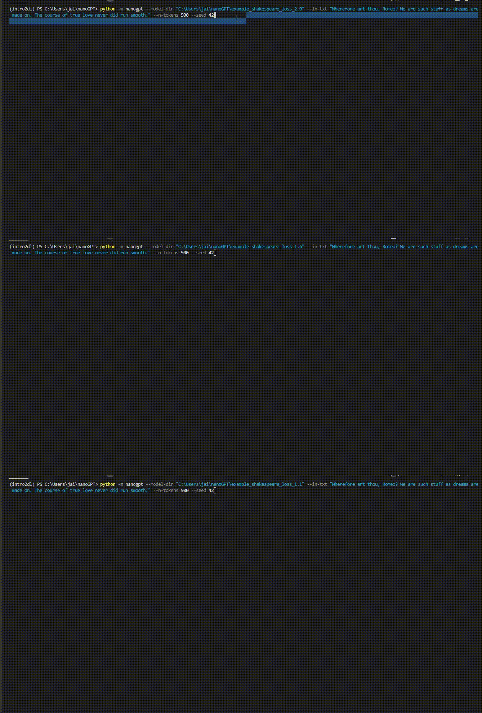
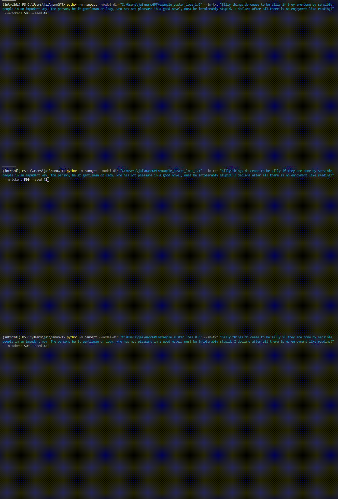

# nanoGPT

[](https://github.com/jkbhagatio/nanoGPT/actions/workflows/build_env_run_tests.yml)

[](https://codecov.io/gh/jkbhagatio/nanoGPT)

A minimal (nanomal?) repository containing code for building, training, and running nanoGPT: a nano-version of OpenAI's GPT-3 Decoder-only Transformer, following this tutorial from Andrej Karpathy: https://www.youtube.com/watch?v=kCc8FmEb1nY

A trained nanoGPT using this codebase acts only as a character-level text-completer (i.e. the end of the "pretraining stage" in typical Large Language Model development, here with tokens as only single characters).

Multi-head self-attention is implemented "from scratch", at the level of pytorch tensors. These "self-attention units" are combined in "transformer blocks", which are then used in the nanoGPT model class.

While the overall architecture is similar, this nanoGPT makes departures from Karpathy's nanoGPT in: naming conventions, data loading and training configuration, projecting embedding dimensions to attention heads, the format of operations in self-attention units and transformer blocks, output model generation (by adding parameters such as `temp` and `top_k`), and more.

## Examples

### nanoGPT-Shakespeare

Trained on the complete works of William Shakespeare. 

Output generated from models trained after approximately 320000 (top), 640000 (middle), and 960000 (bottom) examples.



### nanoGPT-Austen

Trained on the complete works of Jane Austen.

Output generated from models trained after approximately 320000 (top), 640000 (middle), and 960000 (bottom) examples.




## Repository Contents

- `nanoGPT.py` contains code that for building, training, and running nanoGPT.

- `tutorial.ipynb` is a notebook that serves as a tutorial for the step-by-step building of nanoGPT.

- `data/` contains the works of Shakespeare and Austen in .txt format, which can be used to train nanoGPT.

- `tests/` contains tests that can be run via pytest for verifying components of nanoGPT work as expected.

- `.github/workflows/` contains a github actions workflow for building the python environment, running tests, and uploading the results to codecov.

## Usage

### Python environment creation

0. Create and activate a >= Python3.10 environment, clone this repository, then within this repository's directory run `pip install -e .` to install the necessary Python package dependencies from pyproject.toml.

### Run a pretrained nanoGPT model

1. Download a pretrained nanoGPT pytorch model (.pth), its config file (.json), and its tokens file (.json) from [here](https://drive.google.com/drive/folders/1M99XHrX31O8opWYHzTnvVBwEkYadH5ct?usp=sharing)
(e.g. `nanogpt_shakespeare.pth`, `nanogpt_shakespeare_config.json`, `tiny_shakespeare_tokens.txt`) 
and _**save them in a new directory with no other files**_.
2. Then, in the terminal in this repository's directory with the python environment activated, 
```bash
python -m nanogpt --model-dir "<path/to/downloaded_files/>" --in-txt "Wherefore art thou, Romeo? We are such stuff as dreams are made on. The course of true love never did run smooth." --n-tokens 200
```
(run `python -m nanogpt --help` for additional command-line arguments.)

### Train a nanoGPT model

E.g. on the selected works of Jane Austen. Activate the python environment, and within this directory launch a Python interpreter, and...

```python
# Imports
from pathlib import Path
import sys
import torch

# Set torch device
device = torch.device("cuda" if torch.cuda.is_available() else "cpu")

# Import nanogpt
nanogpt_dir = Path.cwd()
sys.path.append(nanogpt_dir)
import nanogpt

# Load in text file to train on and build dataloaders
works_file = nanogpt_dir / "data/tiny_austen.txt"
ctx_len=256
X, Y = nanogpt.build_dataset(works_file, ctx_len)
train_loader, val_loader, test_loader = nanogpt.build_dataloaders(X, Y)

# Instantiate a nanoGPT model object
tokens_file = nanogpt_dir / "data/tiny_austen_tokens.txt"
with open(tokens_file) as f:
    tokens = f.read()
model = nanogpt.NanoGPT(n_tokens=len(tokens), ctx_len=ctx_len)

# Train nanoGPT
optimizer = torch.optim.AdamW(nanogpt.parameters(), lr=1e-3)
loss_fn = nn.CrossEntropyLoss()
nanogpt.train(model, train_loader, val_loader, optimizer, loss_fn, max_epochs=1)  # see nanoGPT.py for additional params for `train()`

# Wait =p ... and then generate output
n_gen_tokens = 500  # number of tokens to generate
nanogpt.generate(model, tokens, n_tokens=n_gen_tokens)

```
